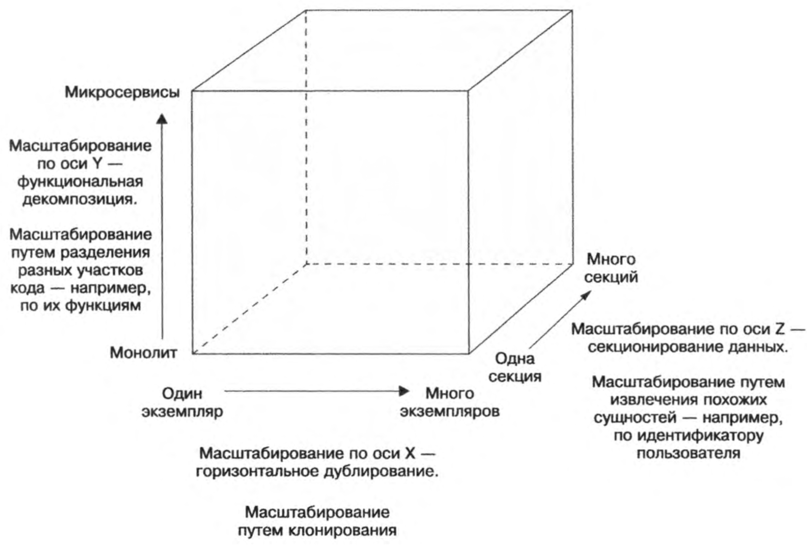
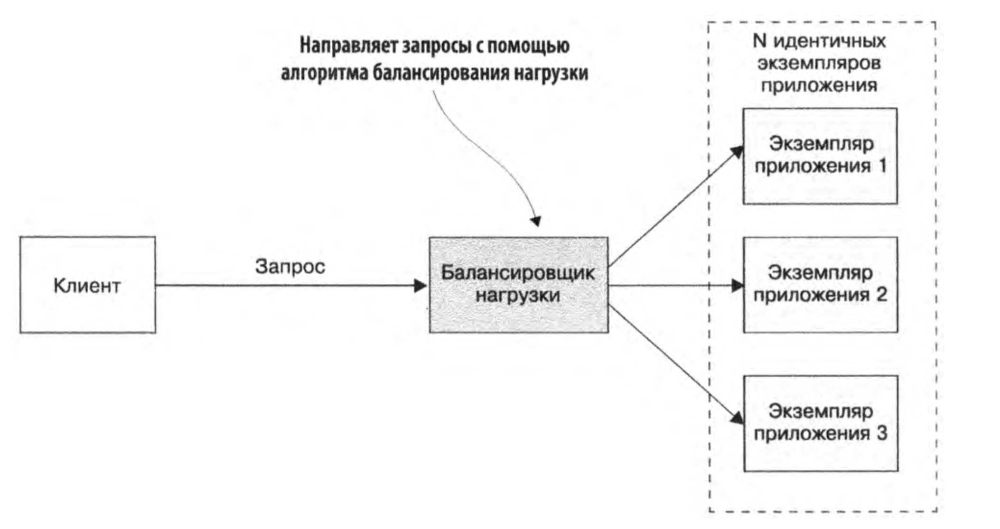

---
aliases:
  - cube scaling
  - Куб масштабирования приложений
tags:
  - maturity/🌱
date:
  - - 2024-04-12
---
Для [[../../meta/zero/00 HighLoad|систем с высокой нагрузкой]] [[Масштабирование информационной системы|масштабирование]] является ключевым аспектом архитектурного проектирования. Концепция масштабирования по осям X, Y и Z помогает понять, как распределить нагрузку и обеспечить стабильность работы приложения.

## Масштабирование по оси Х
Масштабирование по оси X — это увеличение количества одинаковых экземпляров приложения, работающих за [[highload/Балансировка нагрузки|балансировщиком нагрузки]]. Этот подход соответствует понятию [[highload/Горизонтальное масштабирование|горизонтального масштабирования]].

**Как это работает**:  Запросы от клиентов распределяются [[highload/Балансировка нагрузки|балансировщиком]] между несколькими идентичными экземплярами системы.

**Основная цель**:
- Увеличение [[Throughput|пропускной способности]].
- Повышение [[../../../../_inbox/Reliability|отказоустойчивости]] за счет резервирования.

**Пример применения**: [[Монолитная архитектура|Монолитные приложения]], где запуск дополнительных экземпляров не требует изменения кода.

## Масштабирование по оси Z
Масштабирование по оси Z предполагает разделение системы на подмножества данных, где каждый экземпляр приложения отвечает за обработку определенного набора данных.

**Как это работает**: Входящий запрос направляется маршрутизатором к соответствующему экземпляру на основании определенного атрибута (например, `userid` или региона).

**Основная цель**:
- Уменьшение нагрузки на каждый экземпляр.
- Ускорение обработки запросов за счет уменьшения объема данных, с которыми работает каждый узел.

**Пример применения**: [[../../../../_inbox/Шардирование БД|Шардирование]] баз данных, где данные распределяются между разными серверами.

## Масштабирование по оси Y
Масштабирование по оси Y основывается на функциональной [[Декомпозиция на микросервисы|декомпозиции системы]]. Вместо дублирования или разделения данных приложение разбивается на отдельные модули или сервисы.

**Как это работает**: Монолитное приложение делится на самостоятельные модули или микросервисы, каждый из которых отвечает за свою часть функционала.

**Основная цель**:
- Упрощение разработки и поддержки системы.
- Устранение узких мест, связанных с усложнением монолита.

**Пример применения**: [[../../../../wiki/zero/00 Микросервисная архитектура|Микросервисная архитектура]], где каждый сервис обрабатывает свои задачи (например, управление пользователями, обработка платежей, логирование).

***
## Мета информация
**Область**:: [[../../meta/zero/00 Архитектура ИС|00 Архитектура ИС]]
**Родитель**:: [[Масштабирование информационной системы]]
**Источник**:: 
**Автор**:: 
**Создана**:: [[2024-04-12]]
### Дополнительные материалы
- 
### Дочерние заметки
<!-- QueryToSerialize: LIST FROM [[]] WHERE contains(Родитель, this.file.link) or contains(parents, this.file.link) -->
