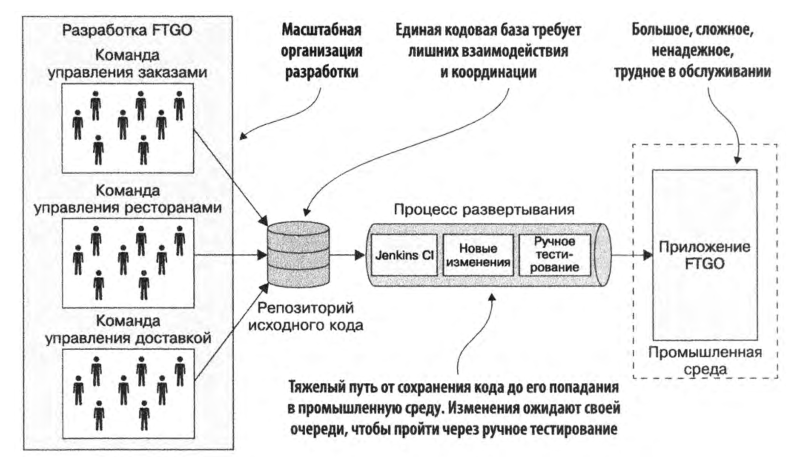

---
aliases:
  - монолитном аду
  - монолитного ада
tags:
  - maturity/🌱
date:
  - - 2024-04-04
---
**Монолитный ад** — это состояние [[Монолитная архитектура|монолитного приложения]], в котором его сложность и размеры становятся настолько большими, что разработка, поддержка и развитие системы превращаются в серьёзную проблему. Приложение становится практически непонятным для одного разработчика, а любая попытка изменить код или добавить новую функциональность усиливает хаос.

**Основные симптомы монолитного ада**
- **Медленная разработка**. Сборка кода занимает слишком много времени. Большое приложение долго запускается, что затягивает цикл разработки: написание, сборка, запуск, тестирование.
- **Медленные и сложные релизы**. Разные команды работают над одной кодовой базой. Даже если монолит разбит на модули, выпуск релиза невозможен, пока все команды не завершат свои изменения. Это приводит к задержкам и конфликтам.
- **Постепенное устаревание технологий**. Переход на новые фреймворки или инструменты в монолите становится практически невозможным. Нельзя точечно обновить технологии для одного модуля, например, использовать Spring для модуля оплаты и Quarkus для управления пользователями.

**Причины возникновения монолитного ада**
- **Рост команды и кодовой базы**. Чем больше разработчиков работает над проектом и чем больше кода добавляется, тем сложнее становится система. При этом сложность системы обычно растёт экспоненциально, что усугубляет ситуацию.
- **Плохая архитектура и низкая читаемость кода**. Когда кодовая база плохо структурирована, разработчики не могут вносить изменения корректно. Это приводит к новым ошибкам и ещё большей путанице.
- **Увеличение технического долга**. Непродуманные изменения ради краткосрочных целей делают код менее поддерживаемым, что в долгосрочной перспективе замедляет разработку.

**Последствия монолитного ада**
- [[Большой комок грязи]]. Проблемы монолита приводят к тому, что система превращается в плохо структурированный, запутанный код, который трудно понять и поддерживать.
- **Снижение производительности команды**. Разработчики вынуждены тратить больше времени на понимание существующего кода, чем на реализацию новых функций.
- **Повышенные риски отказов**. Ошибка или сбой в одной части системы может полностью нарушить её работу, так как все модули тесно связаны.
- **Замедление внедрения инноваций**. Устаревший стек технологий и сложность внедрения изменений препятствуют использованию современных подходов, что снижает конкурентоспособность продукта.

**Как избежать монолитного ада?**
- Планомерный [[../efficiency/Рефакторинг кода|рефакторинг]]. Регулярное улучшение кода и упрощение архитектуры позволяют снизить сложность системы и избежать накопления технического долга.
- Переход на [[../../../../wiki/zero/00 Микросервисная архитектура|микросервисную архитектуру]]. Если приложение становится слишком сложным, можно начать выделять отдельные модули в микросервисы. Это разделяет ответственность и снижает связность системы.
- [[../efficiency/Стандартизация подходов в разработке|Стандартизация подходов в разработке]]. Использование единых стандартов и инструментов помогает команде работать более эффективно и избежать хаоса.
- **Контроль за качеством кода**. Внедрение строгих код-ревью, тестирования и анализа статического кода позволяет предотвращать появление проблем ещё на этапе разработки.
***
## Мета информация
**Область**:: [[../../meta/zero/00 Архитектура ИС|00 Архитектура ИС]]
**Родитель**:: [[Монолитная архитектура]]
**Источник**:: 
**Автор**:: 
**Создана**:: [[2024-04-04]]
### Дополнительные материалы
- 
### Дочерние заметки
<!-- QueryToSerialize: LIST FROM [[]] WHERE contains(Родитель, this.file.link) or contains(parents, this.file.link) -->
