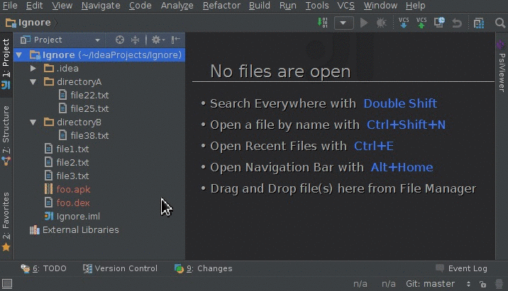
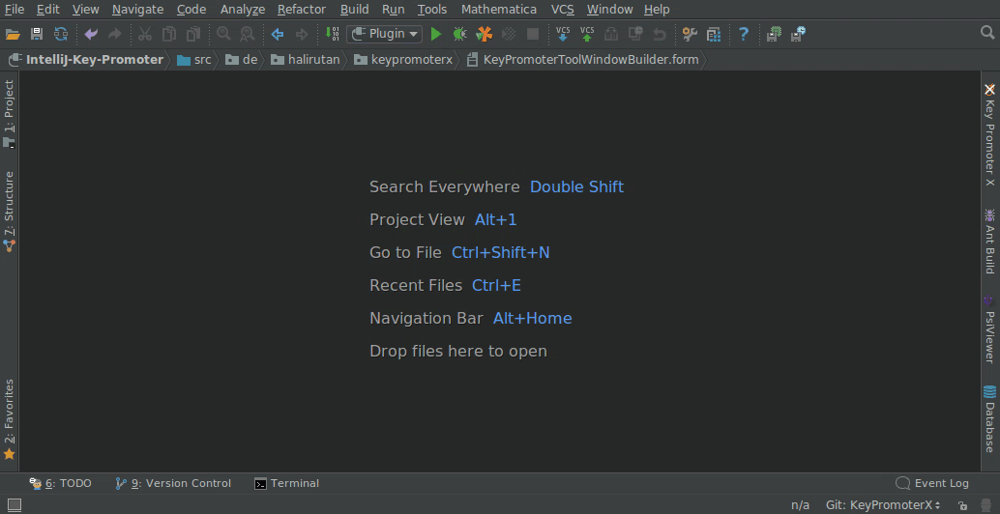

Хочу поделиться небольшой подборкой полезных плагинов, которые помогают мне ускорить и улучшить процесс написания кода.

> [!INFO] 
> Все плагины актуальны для IntelliJ 2023.3.3
## SonarLint
SonarLint работает так же, как статический анализатор кода [SonarQube](https://www.sonarsource.com/products/sonarqube/). Он изучает ваш код в проекте и предлагает улучшения. Анализ происходит в процессе написания, так что ошибки можно будет исправить до коммита.

Это был мой любимый плагин, когда я только начинал работать. Со временем многие проблемы ты запоминаешь и обходишь стороной. Плагин снова становится полезным, когда вы занимаетесь со стажерами, экономит ваше время на поиск типичных ошибок.

Если ваш проект анализируется в SonarQube или SonarCloud, SonarLint может подключиться к серверу, чтобы получить соответствующие профили качества и настройки для этого проекта.

**Кому рекомендую:** Если вы Junior, то для вас это незаменимый инструмент, который позволит улучшить ваш код.

**Ссылка для установки:** [SonarLint - IntelliJ IDEs Plugin | Marketplace](https://plugins.jetbrains.com/plugin/7973-sonarlint)
## Translation
Если у вас все печально с английским, то вам часто приходится перемещаться между Idea и переводчиком в браузере. Translation избавляет вас от этой проблемы.

Возможности:
- Множественные движки перевода:
    - Google переводчик
    - Youdao переводчик
    - Переводчик Baidu
- Перевод JavaDoc
- Озвучивание текста

**Кому подойдет:** Этот плагин для тех, кто плохо знает английский язык.

**Ссылка на установку:** [Translation - IntelliJ IDEs Plugin | Marketplace](https://plugins.jetbrains.com/plugin/8579-translation)
## .ignore
Простой плагин, который помогает генерировать файлы исключений, такие как `.gitignore` и `.dockerignore`.

**Ссылка на установку:** [.ignore - IntelliJ IDEs Plugin | Marketplace](https://plugins.jetbrains.com/plugin/7495--ignore)
## Key Promoter X
Сам я им не пользуюсь, но многие используют. Плагин показывает вам какими сочетаниеми горячих клавиш вы могли бы выполнить действие, которое выполнили мышью.

**Ссылка на установку:** [Key Promoter X - IntelliJ IDEs Plugin | Marketplace](https://plugins.jetbrains.com/plugin/9792-key-promoter-x)
## String Manipulation
Плагин для работы со строками. Может переводить все строки в верхний/нижний регистр, сортировать строки и прочие манипуляции.

**Ссылка на установку:** [String Manipulation - IntelliJ IDEs Plugin | Marketplace](https://plugins.jetbrains.com/plugin/2162-string-manipulation)
## Presentation Assistant
Этот плагин отлично дополнит ваш live coding, потому что его задача ненавязчиво выводить комбинации клавиш, которые вы нажимаете. Даже если вы не будете нажимать сочетание клавиш, а просто кликаете мышкой, но для этого есть хоткей, то он также будет выведен.

**Кому подойдет:** Тем кто проводит вебинары. Также он мне больше нравится, чем Key Promoter X для изучения хоткеев.

**Ссылка на установку:** [Presentation Assistant for 2023.2 - IntelliJ IDEs Plugin | Marketplace](https://plugins.jetbrains.com/plugin/7345-presentation-assistant)
***
## Мета информация
**Область**:: [[../../meta/zero/00 Java разработка|00 Java разработка]]
**Родитель**:: 
**Источник**:: 
**Автор**:: 
**Создана**:: [[2024-09-08]]
### Дополнительные материалы
- 
### Дочерние заметки
<!-- QueryToSerialize: LIST FROM [[]] WHERE contains(Родитель, this.file.link) or contains(parents, this.file.link) -->
