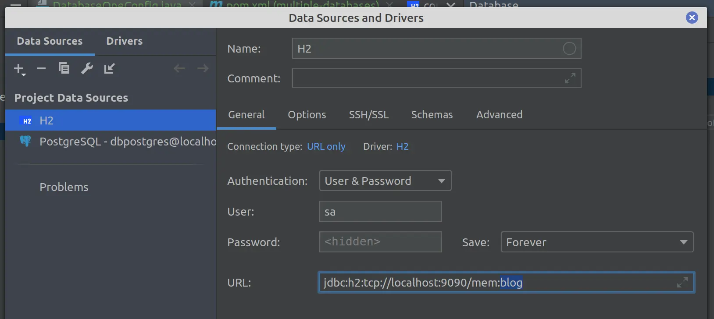

Когда я создаю [обучающие репозитории к своим статьям](https://github.com/Example-uPagge), то использую H2 в качестве базы данных. Проблема с H2 в том, что когда запущено приложение, нельзя просто подключиться и посмотреть что происходит в БД. Эта заметка показывает, как провернуть этот финт.

Имеем следующее подключение к базе данных:

```yml
spring:
  datasource:
    driver-class-name: org.h2.Driver
    url: jdbc:h2:mem:blog
    password: password
    username: sa
  jpa:
    hibernate:
      ddl-auto: create-drop
    database-platform: org.hibernate.dialect.H2Dialect
```

В вашем Spring приложении необходимо создать следующий `@Bean`:

```java
import org.h2.tools.Server;

@Configuration
public class BeanConfig {

    @Bean(initMethod = "start", destroyMethod = "stop")
    public Server inMemoryH2DatabaseaServer() throws SQLException {
        return Server.createTcpServer("-tcp", "-tcpAllowOthers", "-tcpPort", "9090");
    }

}
```

Это фактически создает сервер для остальных подключений к H2.

> [!WARNING] 
> Если класс `org.h2.tools.Server` не находится, то скорее всего у зависимости для H2 установлен scope `runtime`. Удалите значение `scope` и класс появится.

Теперь можно подсоединиться к H2 используя следующий url:

```text
jdbc:h2:tcp://localhost:9090/mem:blog
```



Ограничение этого способа в том, что ==нельзя подключиться к базе, если приложение не работает.==

***
## Мета информация
**Область**:: [[../../meta/zero/00 Снипеты для Java|00 Снипеты для Java]]
**Родитель**:: 
**Источник**:: 
**Автор**:: 
**Создана**:: [[2024-04-07]]
### Дополнительные материалы
- 
### Дочерние заметки
<!-- QueryToSerialize: LIST FROM [[]] WHERE contains(Родитель, this.file.link) or contains(parents, this.file.link) -->
