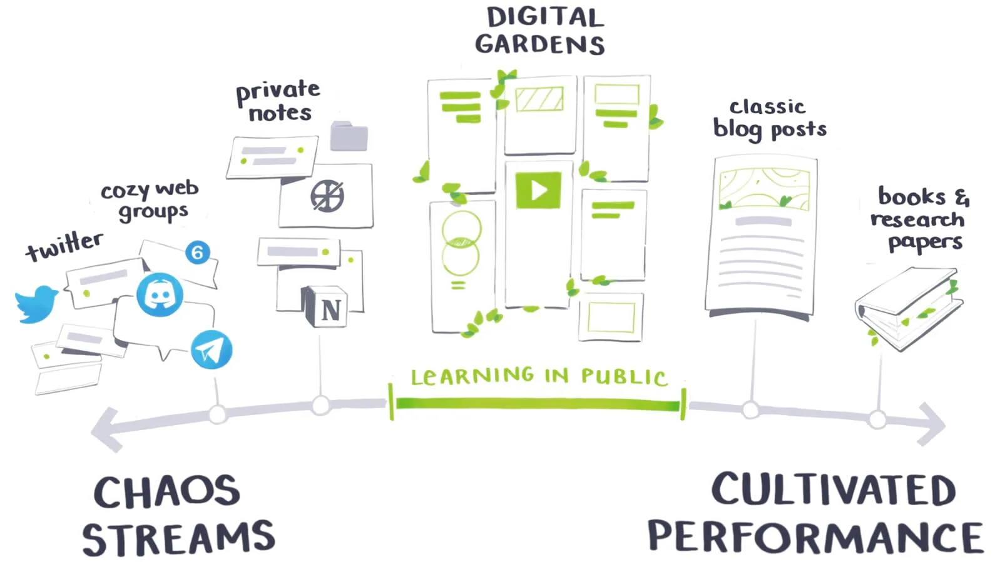

---
date:
  - - 2024-09-01
title: Struchkov's Digital Garden
---
👋 Привет!

Я Стручков Марк, и это мой "цифровой сад" — место, где я собираю свои мысли, идеи, проекты и вдохновение. 
## 🍃 Что такое Цифровой Сад?
Стоит сразу прояснить, что цифровой сад это не блог. Это особый формат ведения заметок и записей в интернете. В отличие от традиционного блога, он не следует строгой хронологии и не стремится к идеальному завершению каждой записи. Представьте себе место, где идеи могут расти, пересекаться и менять направление. Записи здесь — это как маленькие растения, которые можно пересаживать, подкармливать и наблюдать, как они со временем изменяются.

Основная идея цифрового сада — это процесс, а не результат. Здесь можно увидеть черновики мыслей, промежуточные этапы работы над проектами и идеи, которые ещё только ждут своего часа. Всё связано между собой гипер-ссылками, создавая сеть знаний, которую можно изучать и расширять.

## Чего стоит избегать
> [!WARNING] DISCLAMER
> Приветствуются комментарии по теме заметки для улучшения и исправления фактических ошибок. Но ==не стоит указывать на грамматические ошибки или опечатки.== В первую очередь это мои заметки, которые можн

