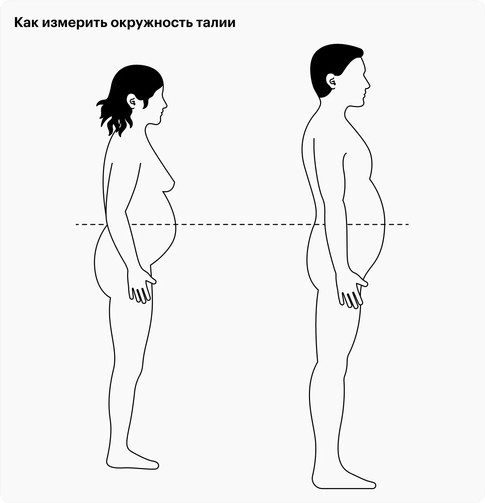

Абдоминальное ожирение — избыточное количество жира на внутренних органах.

Этот вид [[Ожирение|ожирения]] ассоциируется с повышенным риском развития сердечно-сосудистых заболеваний, [[../../../../knowledge/health/болезни/Диабет|сахарного диабета]] 2-го типа и гипертонии. Ключевым показателем абдоминального ожирения является окружность талии, которая не должна превышать 94 см у мужчин и 80 см у женщин.

Иногда такое наблюдается даже при нормальном [[../Индекс массы тела|ИМТ]], поэтому главный критерий здесь — обхват талии. Ключевым показателем абдоминального ожирения является окружность талии, которая не должна превышать 94 см у мужчин и 80 см у женщин.

***
## Мета информация
**Область**:: [[../../meta/zero/00 Здоровье|00 Здоровье]]
**Родитель**:: [[../Болезни|Болезни]], [[Ожирение|Ожирение]]
**Источник**:: 
**Автор**:: 
**Создана**:: [[2023-11-01]]
### Дополнительные материалы
- 
### Дочерние заметки
<!-- QueryToSerialize: LIST FROM [[]] WHERE contains(Родитель, this.file.link) or contains(parents, this.file.link) -->
