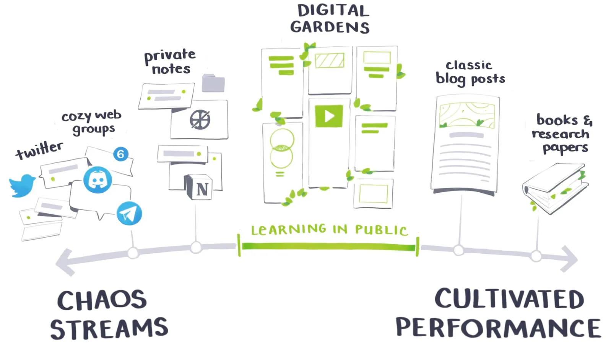

Приветствую 👋
Меня зовут [[meta/people/Стручков Марк|Стручков Марк]]. Я архитектор информационных систем из Рязани 👀🍄
Мне ~~23~~, ~~24~~, ~~25~~, ~~26~~, ~~27~~, 28 лет.

Ты забрел в мой "[Цифровой сад](education/Цифровой%20сад.md)" 🪴🪴🪴
## 🍃 Что такое Цифровой Сад?
[Цифровой сад](education/Цифровой%20сад.md) это особый способ ведения публичных заметок. В отличие от традиционного блога, он не следует строгой хронологии и не стремится к [идеальному](psychology/Перфекционизм.md) завершению каждой записи.

Основная идея цифрового сада — это процесс, а не результат. Это место, где идеи могут расти, пересекаться и менять направление. Записи здесь — это как маленькие растения, которые можно пересаживать, подкармливать и наблюдать, как они со временем изменяются.

Я публикую не все свои заметки, но опубликованная заметка может ссылаться на не опубликованную. В таком случае ссылка будет вести на страницу 404. В этом случае можно написать в комментарии к заметке и вежливо попросить поделиться заметкой, возможно я просто забыл ее опубликовать.
### 🤔 Зачем мне сад?
**Ведение заметок это отличный способ накапливать знания и обучаться.** Я пишу заметки в процессе изучения какой-то новой темы. После чего структурирую их какое-то время. И уже после могу решить опубликовать заметки в мой цифровой сад.

Все люди делают ошибки, особенно в процессе обучения, это нормально. Поэтому не стоит считать все написанное тут истинной в последней инстанции. ==Если заметили фактическую ошибку, то можете воспользоваться кнопкой "Редактировать"== и предложить свое исправление, или оставьте комментарий на странице с заметкой.

**Делиться знаниями.** Когда ко мне приходят с вопросами, я хочу иметь возможность быстро передать свои знания и опыт.

**Участвовать в дискуссиях.** ==У каждой заметки можно оставить комментарии, не стесняйтесь обсуждать прочитанное и оставлять свои мысли.== Это улучшает заметки и позволяет им быстрее развиваться.
## 🗺 Как не заблудиться?
Чтобы получить максимальную пользую от сада, нужно научиться в нем ориентироваться. Этот раздел поможет вам.

- 🔎 Если вы ищите что-то конкретное, то воспользуйтесь поиском.
- 🧑‍🔬 Для настоящих исследователей в нижней части сайта есть кнопка: "<a id="random-page-button">Мне повезет 🎲</a>", которая переместит вас на случайную заметку. Это отличный способ узнать что-то новое.
- 🔗 Граф знаний. Находится в правом верхнем углу. По нему можно изучить связи заметок между собой.
- 🎓 В конце каждой заметки есть раздел **Мета информация**. Эта информация позволит изучать тему дальше. Там указано следующее
	- Область знания, к которой относится заметка.
	- Родительская заметка по теме.
	- Дочерние заметки.
	- Дополнительные материалы.
	- Обратные ссылки. Это список заметок, которые ссылаются на текущую заметку.
	- Дата создания заметки. По ней можно получить созданные в этот день заметки. Пока в разработке.
	- Все дочерние заметки.
### 🌳 Корни дерева знаний
Каждая заметка принадлежит какой-то "области знаний" - #type/zero-link . А здесь можно видеть иерархию всех областей знаний. Это корни деревьев моего сада. С этих заметок можно начать погружаться в определенную область.

- [[meta/zero/00 Здоровье|Здоровье]]
- [Продуктивность](meta/zero/00%20Продуктивность.md) / [[meta/zero/00 Командная продуктивность|Командная продуктивность]]
- [Разработка](meta/zero/00%20Разработка.md)
	- [Java разработка](meta/zero/00%20Java%20разработка.md)
		- [Quarkus](meta/zero/00%20Quarkus.md)
		- [SpringBoot](meta/zero/00%20SpringBoot.md)
		- [Hibernate](meta/zero/00%20Hibernate.md) / [[meta/zero/00 Hibernate Reactive|Hibernate Reactive]]
		- Сборщики
			- [[meta/zero/00 Maven|Maven]]
			- [[meta/zero/00 Gradle|Gradle]]
	- Архитектура
		- [[meta/zero/00 Архитектура ЭВМ|Архитектура ЭВМ]]
		- [Архитектура ПО](meta/zero/00%20Архитектура%20ПО.md)
		- [Архитектура ИС](meta/zero/00%20Архитектура%20ИС.md)
			- [[meta/zero/00 HighLoad|HighLoad]]
	- [[meta/zero/00 Реляционная база данных|Базы Данных]]
		- [[meta/zero/00 PostgreSQL|PostgreSQL]]
	- [DevOps](meta/zero/00%20DevOps.md)
		- [Docker](meta/zero/00%20Docker.md)
	- [[meta/zero/00 Linux|Linux]]
	- [Сети](meta/zero/00%20Сети.md)
	- [Алгоритмы](meta/zero/00%20Алгоритм.md)
	- [[meta/zero/00 Тестирование ПО|Тестирование ПО]]
	- [Snippets](meta/zero/00%20Snippets.md)
- [Образование](meta/zero/00%20Образование.md)
- [Обучение](meta/zero/00%20Обучение.md)
- [Психология](meta/zero/00%20Психология.md)
### 🏷 Теги
Теги группируют заметки из разных областей знаний по какому-то признаку.

**По качеству заметок:**
#maturity/🌱 - Самые новые публичные заметки. Могут быть оформлены небрежно и содержать фактические и грамматические ошибки.
#maturity/🌿  - Заметки к которым я возвращался хотя бы один раз и проводил их переработку. Меньше логических ошибок, и лучшая связанность с другими заметками.
#maturity/🌾 -  Заметки, которые несколько раз подвергались осмыслению и рефакторингу.
#maturity/🌳 - Самые качественные заметки. Работа над ними фактически завершилась. Больших изменений в ближайшее время не планируется.

**По типу контента:**
#content/opinion - Мое субъективное мнение по какой-то теме, по какому-то вопросу.
#content/problem - Заметки, которые появились для решения проблем, с которыми я сталкивался.
#content/checklist - Различные полезные чек-листы.
#type/archive - Архивные заметки. Их обновление не планируется, так как тема потеряла для меня интерес.

## ☎️ Контакты
- [Мой блог о разработке на Java](https://struchkov.dev)
- [Мой телеграм канал о разработке.](https://t.me/@struchkov_dev)
- [Связаться со мной](https://mark.struchkov.dev)