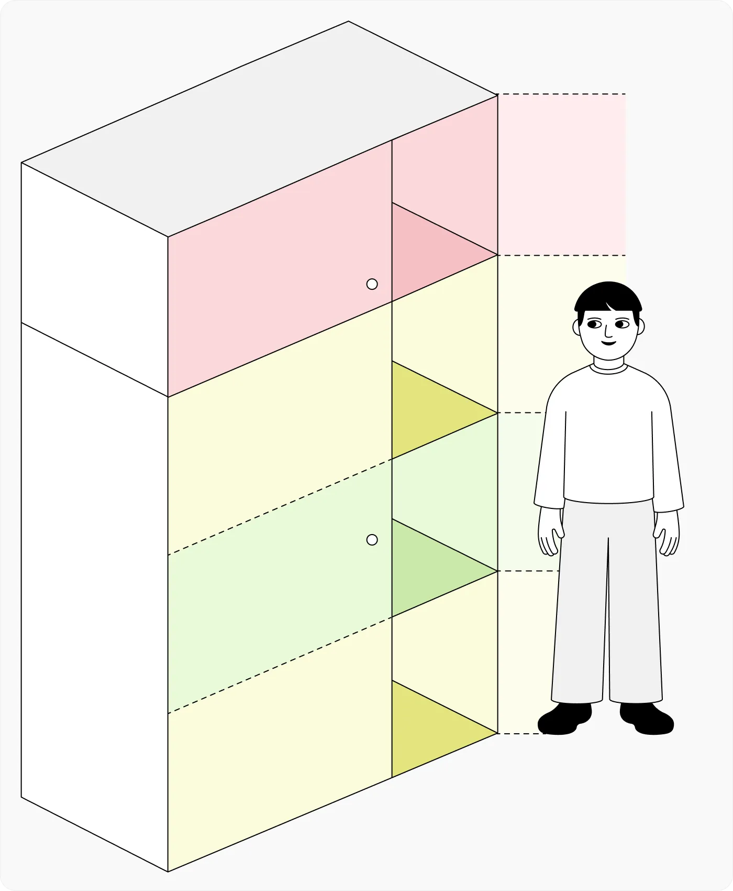
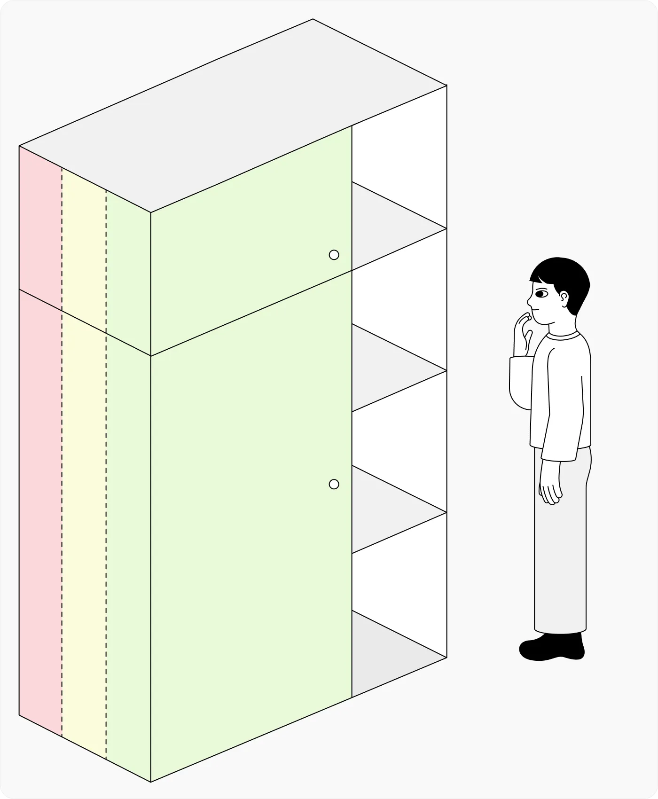
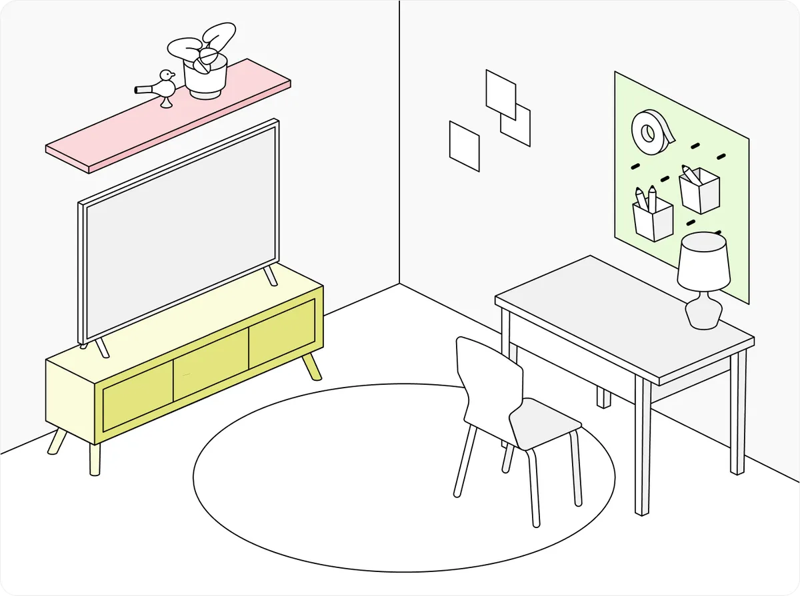
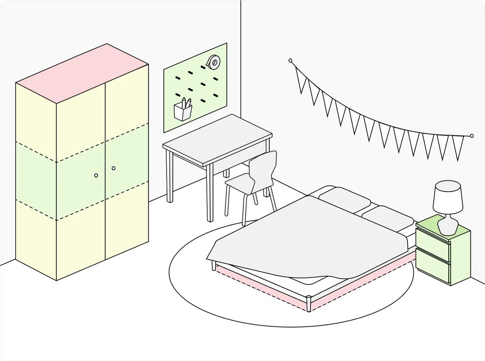
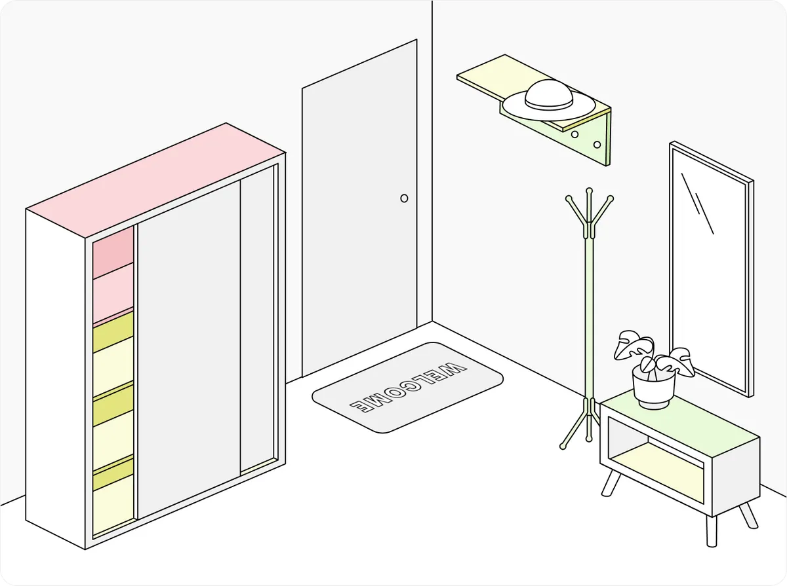
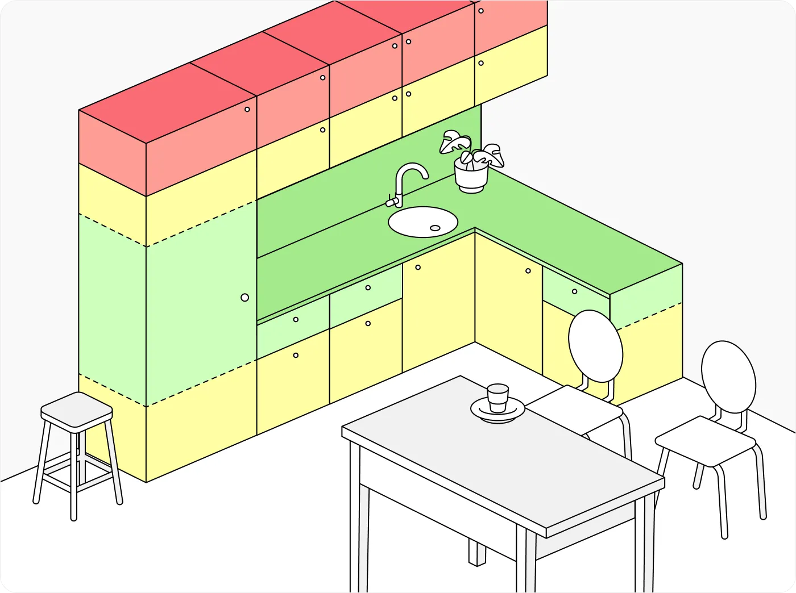
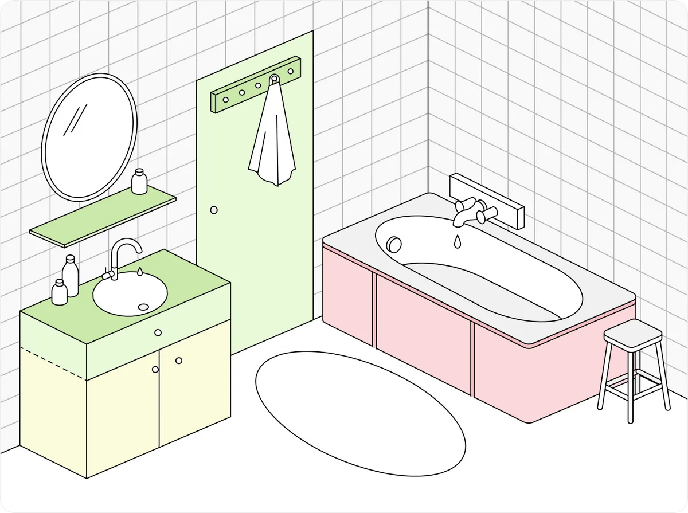

---
aliases:
  - принцип «легко взять»
tags:
  - maturity/🌱
date: 2024-11-17
---
Организация хранения вещей на кухне или в других зонах дома должна быть удобной и логичной. Принцип «легко взять» делит пространство на три условные зоны, учитывая частоту использования предметов и легкость доступа к ним.
## Вертикальное зонирование
Представьте шкаф высотой около двух метров.

- **Зеленая зона** — это пространство от уровня подбородка до кончиков пальцев опущенных рук. Это самая доступная и удобная зона для хранения. Здесь лучше всего размещать вещи, которые используются ежедневно: тарелки, стаканы, кастрюли, специи.
- **Желтая зона** — это пространство на полметра выше или ниже зеленой зоны. Оно подходит для хранения предметов, которые используются периодически. Например, праздничная посуда, кухонные гаджеты, которые вы достаете раз в неделю или реже.
- **Красная зона** — это труднодоступные места, такие как верхние полки шкафа или самая нижняя часть под столешницей. Здесь стоит хранить вещи, которые используются редко, например, новогодний сервиз, консервы для долгосрочного хранения или сезонные аксессуары.

## Горизонтальное зонирование
Принцип работает и в глубину шкафов:
- Ближайшие к краю полки области — это **зеленая зона**, где можно хранить часто используемые вещи.
- Средняя часть глубины шкафа относится к **желтой зоне**. Для доступа к предметам здесь нужно приложить больше усилий, поэтому они используются реже.
- Самые дальние области полок — **красная зона**, в которой удобно размещать редко используемые вещи.

## Другие примеры

***
## Мета информация
**Область**:: [[../meta/zero/00 Продуктивность|00 Продуктивность]]
**Родитель**:: 
**Источник**:: 
**Создана**:: [[2024-11-17]]
**Автор**:: 
### Дополнительные материалы
- 

### Дочерние заметки
<!-- QueryToSerialize: LIST FROM [[]] WHERE contains(Родитель, this.file.link) or contains(parents, this.file.link) -->

